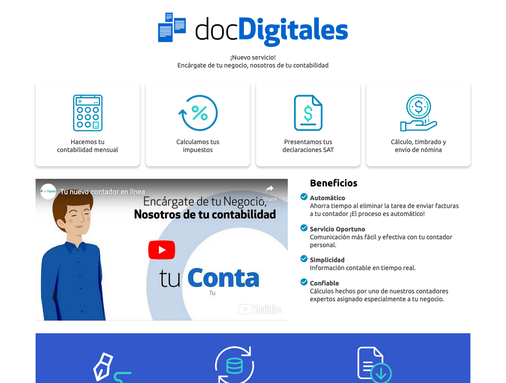
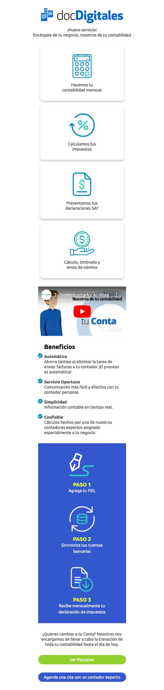
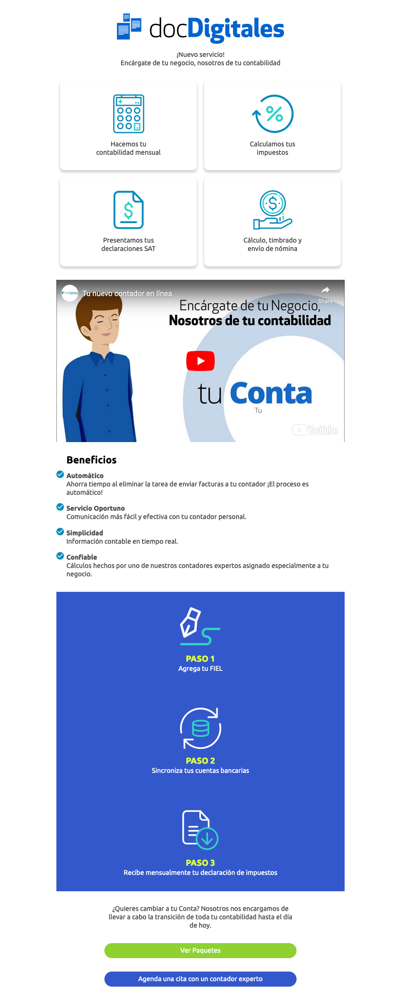
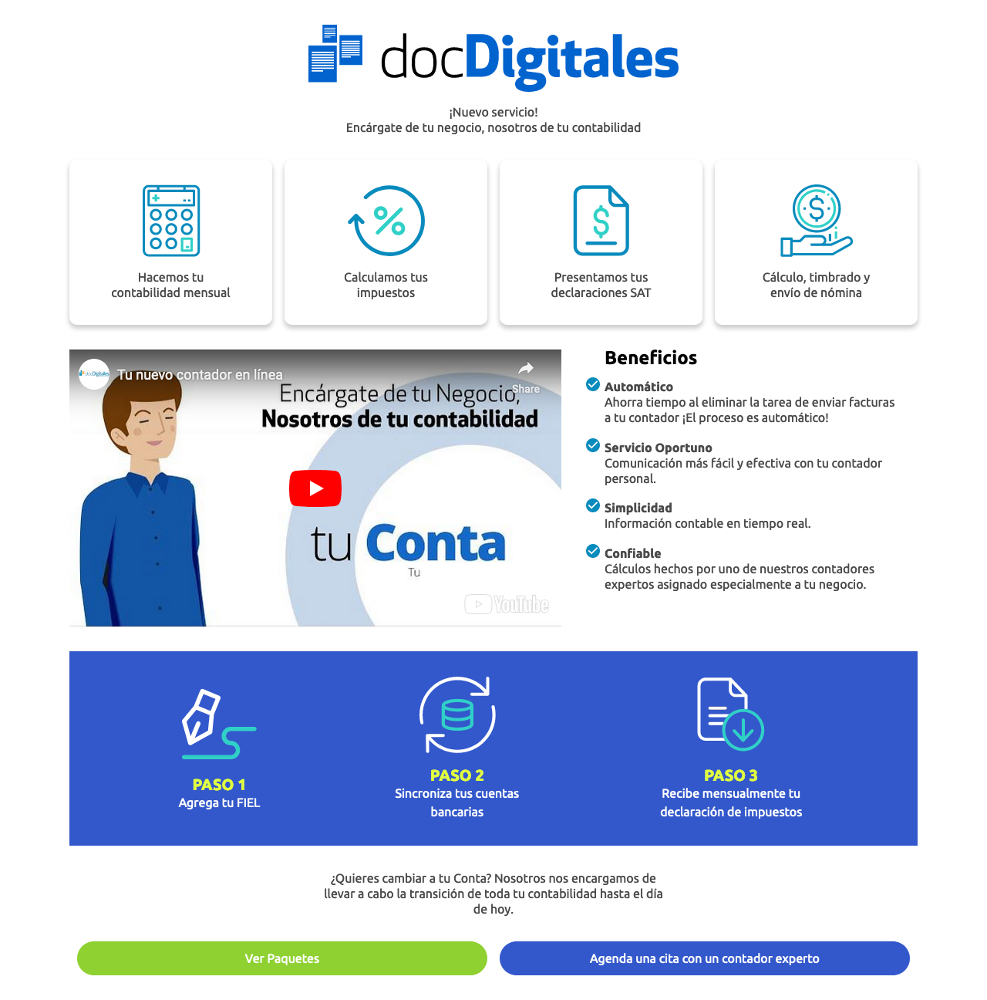
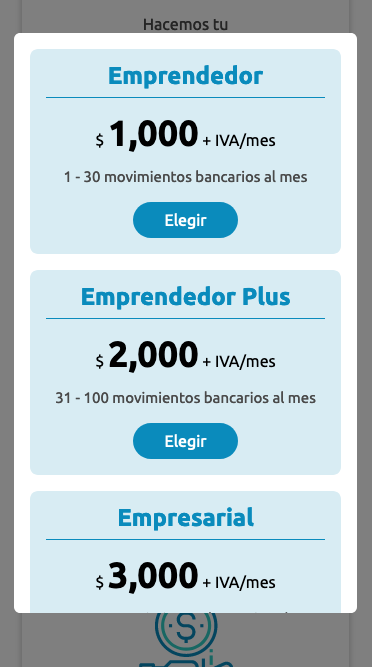
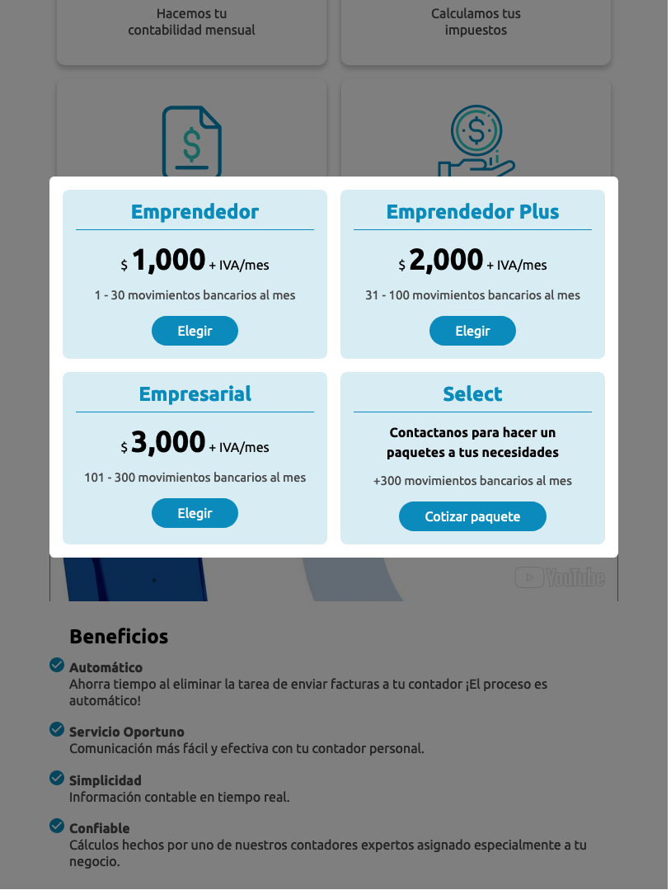
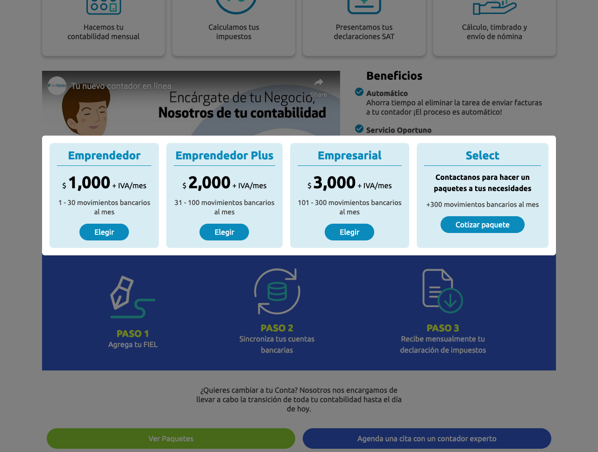

# tu Conta. Tu contador en línea.

Se requiere generar el `html` de la siguiente pantalla y que cumpla con los siguientes requisitos:

- Utilizar `css`, `javascript` y flexbox por lo menos.
- Los 4 cards deben tener algún cambio al hacer hover.
- El botón **"Ver paquetes"** mostrará un modal sencillo.
- El video puede ser algún video de YouTube.
- El botón azul no tiene ninguna funcionalidad.
- La información del modal solo es estática.
- Los íconos y el logo pueden ser genéricos o usar fontawesome.
- Diseño responsivo (deseable).

## Vista previa de la página

_Vista previa de tu Conta_

_Vista previa de tu Conta (móvil)_

_Vista previa de tu Conta (tablet)_

_Vista previa de tu Conta (escritorio)_

## Vista previa del modal (ver paquetes)

_Vista previa del modal (móvil)_

_Vista previa del modal (tablet)_

_Vista previa del modal (escritorio)_
